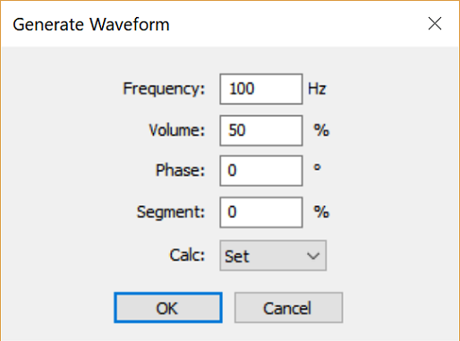

# waveform-box
Waveform sound playground application for Windows. Generating waveform from specified frequency. FFT analyzer up to 65 kHz. Support to play, read and save wav-format file.

# Snapshots

Main Window

# Associated documentation

- [A document describes the .wav file format](http://necotech.org/archives/657) (In Japanese)
